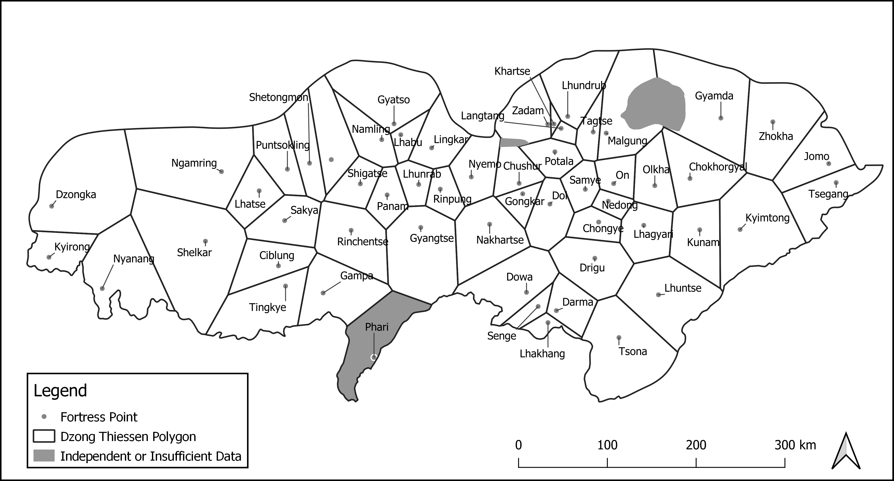
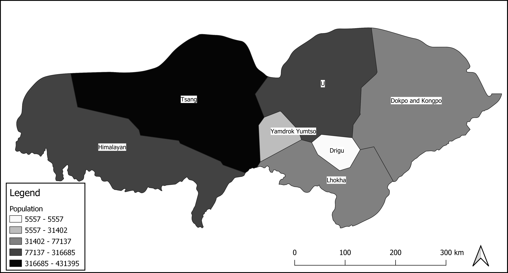
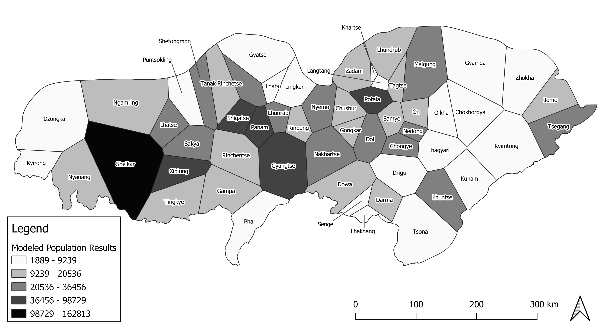
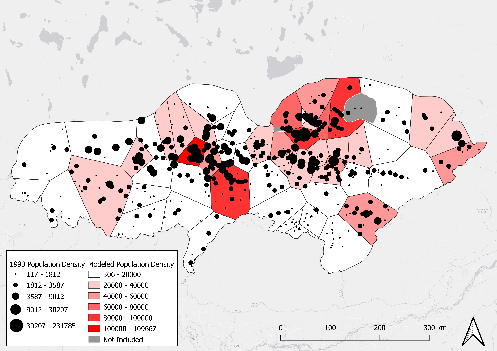

```{r setup, include=FALSE}
knitr::opts_chunk$set(message=FALSE,warning=FALSE, cache=FALSE)
knitr::opts_knit$set(root.dir = "C:/Users/bowma/Documents/data_analyst_portfolio")
```

I can also employ Python for data cleaning and transformation work as well as any time I need to interface with another software such as ArcGIS or QGIS. Here, I will demonstrate how I used Python to clean and prepare census data for joining to spatial points, then use a script within QGIS to transform that census data and other spatial features into insights about demographics. This study was interested in estimating the clerical population for historical Tibet.

The article can be found [here](https://himalaya.socanth.cam.ac.uk/collections/journals/ret/pdf/ret_61_06.pdf 'Go').

# Loading and cleaning data

```{python}
import os
import pandas as pd
import seaborn as sb

# Setting Working Directory
#os.chdir(r"C:\Users\bowma\Documents\Monk Census Project\Data")
#os.getcwd()

# Load Monk census data
CTMdata = pd.DataFrame(pd.read_excel(r"C:\Users\bowma\Documents\data_analyst_portfolio\data\CentralTibetListOfMonasteriesTseringEnteredNov2005.xls"))
print (CTMdata)

# Remove unwanted columns
cols = [0,3,4,7]
CTMdata.drop(CTMdata.columns[cols],axis=1,inplace=True)

CTMdata.columns = ["gisid","dzong","monks","nuns"]

# Fill NA with zero for further math

CTMdata = CTMdata.fillna(0)

# Trim white space in dzong names that leads to one of them counting as two factor levels

CTMdata['dzong'] = CTMdata['dzong'].str.strip()

# Some consolidation of dzong names to better match GIS data
CTMdata = CTMdata.replace("Sreng dang E khul", "Nedong")
CTMdata = CTMdata.replace("U khul (Potala)", "Potala")
CTMdata = CTMdata.replace("Shigatse dang Rinchen", "Shigatse")
CTMdata = CTMdata.replace("Tsang khul dang Tod khul Rinpung khul", "Rinpung")
CTMdata = CTMdata.replace("Dakpo - Chokhorgyal", "Chokhorgyal")
CTMdata = CTMdata.replace("Dzonga / Saga", "Dzongka")

# Create a new column to hold a total of the two census columns of the original

CTMdata['totalcensus'] = CTMdata['monks'] + CTMdata['nuns']

# Write out the cleaned and updated version of the census data

#CTMdata.to_csv(r'..\Data\CTMdata_edit.csv', index = False)

# Load spatial point data for the monasteries

spatial = pd.DataFrame(pd.read_csv(r"C:\Users\bowma\Documents\data_analyst_portfolio\data\spatial_albers.csv"))
print (spatial.head())

# Join CTM data to spatial points by name

join = pd.merge(CTMdata, spatial, on='dzong', how='outer', indicator= True)
#cols = ['gisid_y','altgisid','xcoord','ycoord','_merge']
#join.drop(cols,axis=1,inplace=True)
#join.columns = ['gisid','dzong','monks','nuns','totalcensus']

# Providing an unique numeric id for each unique dzong name for aggregation
join = join.sort_values(['dzong'])
join['gisid'] = pd.factorize(join['dzong'])[0]

print(join.head())
# Aggregate census data on dzong (one entry per unique id)

agg = join.groupby(
   ['gisid']
).agg(
    {
         'gisid':'first',
         'dzong': 'first',
         'monks': sum,
         'nuns': sum,
         'totalcensus': sum,    
    }
)


# Copy data for Shigatse to Rinchentse

agg.loc[agg['dzong'] == 'Rinchentse', 'totalcensus'] = agg.iloc[52,2]

# Make Phari "no data"

agg.loc[agg['dzong'] == 'Phari', 'totalcensus'] = 0


# Make Phari 0 given historical circumstances
agg.loc[(agg['dzong'] == 'Phari'), 'monks'] = 0

# Export final data for spatial join

#agg.to_csv(r'..\Data\datajoin.csv', index = False)


```

# Joining data, calculating geometries, and estimating population in QGIS

The following script loads necessary data into QGIS, generates voronoi polygons for each monestary, calculates area, intersects farmland, voronoi polies, and census data, then runs calculations that estimate total population per area based on farmland and suggested caloric intake per person and compares that to the clerical population as found in the census. 


## Loading data and calculating geometries

```{python, eval=FALSE}

# To be run in QGIS Python Console
# This is not stand-alone script

## Overview ##
#1 Establish working directories
#2 Load required packages
#3 Preparing data for calculations
#4 Calculating area under 4400 meters
#5 Calculating estimated farmland based on sampling
#6 Grain yield per hectare estimation

# Begin Script
print('Script started...')

##################################################################################################################
## 1 ## Establish working directories for incoming and outgoing data to simplify customization and shorten code ##
##################################################################################################################

# Change these paths to those on your local machine where the initial data resides and where you want your outputs to go
inpath = 'Your Data Folder Here'
outpath = 'Your Output Folder Here'

######################################################
## 2 ## Load necessary packages for QGIS processing ##
######################################################
import os
import processing
from PyQt5.QtGui import *
from qgis.core import QgsVectorFileWriter

##########################################
## 3 ## Preparing data for calculations ##
##########################################

# Load csv of prepared Monk Census data pre-processed in python

print('Loading csv...')
csv_path = "file:///../Data/datajoin.csv" #Put the path to your version of the csv here
csv = QgsVectorLayer(csv_path,"datajoin","delimitedtext")
QgsProject.instance().addMapLayer(csv)


# Load fortress points

print('Loading fortress points...')
monastery_path = inpath + 'monk_points_edit.shp'
monastery = iface.addVectorLayer(monastery_path, "", "ogr")


# Load boundary tract

print('Loading boundary...')
tract_path = inpath + 'twang_tract.shp'
tract = iface.addVectorLayer(tract_path, "", "ogr")


# Join csv to fortress shapefile
print('Joining csv to monastery shapefile...')

input = monastery
field = 'dzong'
input_2 = csv
field_2 = 'dzong'
fields_to_copy = ['monks','nuns','totalcensus','ecoregion']
output = outpath + 'joined_points.shp'

processing.runAndLoadResults(
    "native:joinattributestable",
    {'INPUT':input,
    'FIELD':field,
    'INPUT_2':input_2,
    'FIELD_2':field_2,
    'FIELDS_TO_COPY':fields_to_copy,
    'METHOD':1,
    'DISCARD_NONMATCHING':False,
    'PREFIX':'',
    'OUTPUT':output})


# Run voronoi polygon on joined points and add geometry attributes to calculate area + perimeter 

print('Creating Thiessen polygons...')

input = outpath + 'joined_points.shp'
buffer = 150
output = outpath + 'voronoi_poly.shp'

processing.run(
    "qgis:voronoipolygons",
    {'INPUT':input,
     'BUFFER':buffer,
     'OUTPUT':output})

# Adding geometry attributes (area, perimeter) to voronoi polies

input = outpath + 'voronoi_poly.shp'
output = outpath + 'voronoi_geom.shp'

processing.run(
    "qgis:exportaddgeometrycolumns",
    {'INPUT':input,
     'CALC_METHOD':0,
     'OUTPUT':output})


# Run clip on voronoi polies with tract boundary

print('Clipping Thiessen polies to boundary...')

input = outpath + 'voronoi_geom.shp'
overlay = inpath + 'twang_tract.shp'
output = outpath + 'voronoi_clip.shp'

processing.run(
    "native:clip",
    {'INPUT':input,
     'OVERLAY':overlay,
     'OUTPUT':output})


# Run and load voronoi polies as singleparts for geometry fix later (split polygon for Tsegang)

print('Splitting Thiessen result into singleparts...')

input = outpath + 'voronoi_clip.shp'
output = outpath + 'voronoi_singleparts.shp'

processing.run(
    "native:multiparttosingleparts",
    {'INPUT':input,
     'OUTPUT':output})

input = inpath + 'farm_sample.shp'
overlay = inpath + 'china_arable.shp'
output = outpath + 'farm_union.shp'

processing.run(
    "native:union",
    {'INPUT':input,
    'OVERLAY':overlay,
    'OVERLAY_FIELDS_PREFIX':'',
    'OUTPUT':output})
    
# Clip union to boundary tract
input = outpath + 'farm_union.shp'
overlay = inpath + 'twang_tract.shp'
output = outpath + 'farm_clip.shp'

processing.run(
    "native:clip",
    {'INPUT':input,
    'OVERLAY':overlay,
    'OUTPUT':output})
    
# Clip farmland result to exclude independent powers
input = outpath + 'farm_clip.shp'
overlay = inpath + 'independent.shp'
output = outpath + 'farm_clip2.shp'

processing.run("native:difference",
    {'INPUT':input,
    'OVERLAY':overlay,
    'OUTPUT':output})
```

***The results of these tasks look something like this, where each point becomes a voronoi polygon bounded by others and the entire result is clipped to the tract boundary. In addition, areas that were independent of monestary control are excluded using another shapefile that specified those small areas.***



# Estimating grain yields and population

This part of the script combines farmland area data and agronomic and anthropological data in order to estimate a low and high potential for grain yields and from there low and high population estimates based on those yields and caloric intake. The range is important since without hard numbers of historical population or farmland extent/efficiency, we should be careful not to simply spit out one number. There is much variance locally and regionally.

```{python, eval=FALSE}
# Intersect farmland with Thiessens
input = outpath + 'farm_clip2.shp'
overlay = outpath + 'voronoi_singleparts.shp'
overlay_fields = ['dzong','ecoregion']
output = outpath + 'farmland_intersection.shp'

processing.run(
    "native:intersection",
    {'INPUT':input,
     'OVERLAY':overlay,
     'INPUT_FIELDS':[],
     'OVERLAY_FIELDS':overlay_fields,
     'OVERLAY_FIELDS_PREFIX':'',
     'OUTPUT':output})

#Add area and perimeter to farmland sample

print('Calculating area and perimeter...')

input = outpath + 'farmland_intersection.shp'
output = outpath + 'farmland_geom.shp'

processing.run(
    "qgis:exportaddgeometrycolumns",
    {'INPUT':input,
    'CALC_METHOD':0,
    'OUTPUT':output})

print('Aggregating...')

input = outpath + 'farmland_geom.shp'
group_by = '\"dzong\"'
output = outpath + 'farm_agg.shp'

processing.runAndLoadResults(
    "qgis:aggregate", {
    'INPUT':input,
    'GROUP_BY':group_by,
    'AGGREGATES':[
    {'aggregate': 'first_value', 'delimiter': ',', 'input': '"ecoregion"', 'length': 254, 'name': 'ecoregion', 'precision': 0, 'type': 10},
    {'aggregate': 'sum', 'delimiter': ',', 'input': '"area"', 'length': 23, 'name': 'area', 'precision': 15, 'type': 6},
    {'aggregate': 'first_value', 'delimiter': ',', 'input': '"dzong"', 'length': 254, 'name': 'dzong_2', 'precision': 0, 'type': 10}],
    'OUTPUT':output})

# Calculating area in km of farmland as digitized

print('Calculating farm area...')
farm_agg = QgsProject.instance().mapLayersByName("farm_agg")[0]
layer_provider = farm_agg.dataProvider()
layer_provider.addAttributes([QgsField('farm_km', QVariant.Double)])
farm_agg.updateFields()

target_field = 'farm_km'

# Calculates the new square km column by dividing square meters held in area_2 and dividing by 1 million

def calculate_attributes():
    with edit(farm_agg):
        for feature in farm_agg.getFeatures():
            feature.setAttribute(feature.fieldNameIndex('farm_km'), feature['area'] / 1000000)
            farm_agg.updateFeature(feature)
    print(f"Attribute calculated for {target_field} field")

calculate_attributes()

# Create farm_agg_2 as another aggregate by this time the mean farm area by a mean of the samples in the ecoregion.
# This allows the remaining counties to recieve a an estimated farmland per sqkm of area under 4700m without 
# Digitizing all farmland in such a vast area.

print('Aggregating...')

('Joining area calculations to Thiessen polies...')

input = outpath + 'voronoi_singleparts.shp'
field = 'dzong'
input_2 = outpath + 'farm_agg.shp'
field_2 = 'dzong_2'
fields_to_copy = ['farm_km']
output = outpath + 'thiessen_temp.shp'

processing.run(
    "native:joinattributestable",
    {'INPUT':input,
     'FIELD':field,
     'INPUT_2':input_2,
     'FIELD_2':field_2,
     'FIELDS_TO_COPY':fields_to_copy,
     'METHOD':1,
     'DISCARD_NONMATCHING':False,
     'PREFIX':'',
     'OUTPUT':output})


    
# This formula divides estimated farmland by the area of the Thiessen poly yielding a ratio (farm_unit)
input = outpath + 'thiessen_temp.shp'
field_name = 'farm_unit'
formula = '\"farm_km\"  /  \"zone_area\" '
output = outpath + 'thiessen_calc1.shp'

processing.run("qgis:fieldcalculator",
   {'INPUT':input,
    'FIELD_NAME':field_name,
    'FIELD_TYPE':0,
    'FIELD_LENGTH':10,
    'FIELD_PRECISION':5,
    'NEW_FIELD':True,
    'FORMULA':formula,
    'OUTPUT':output})

# This formula multiplies farm units by the area (in raster cells) under 4700 m to estimate potential farmland for a poly
input = outpath + 'thiessen_calc1.shp'
field_name = 'farm'
formula = ' \"farm_unit\"  *  \"zone_area\" '
output = outpath + 'thiessen_calc2.shp'

processing.run(
    "qgis:fieldcalculator",
    {'INPUT':input,
     'FIELD_NAME':field_name,
     'FIELD_TYPE':0,
     'FIELD_LENGTH':10,
     'FIELD_PRECISION':5,
     'NEW_FIELD':True,
     'FORMULA':formula,
     'OUTPUT':output})

# Calculating hectares from sqkm
print('Calculating hectares...')

input = outpath + 'thiessen_calc2.shp'
field_name = 'farm_hec'
formula = ' \"farm_km\"  * 100'
output = outpath + 'thiessen_calc3.shp'

processing.run(
    "qgis:fieldcalculator",
    {'INPUT':input,
     'FIELD_NAME':field_name,
     'FIELD_TYPE':0,
     'FIELD_LENGTH':10,
     'FIELD_PRECISION':3,
     'NEW_FIELD':True,
     'FORMULA':formula,
     'OUTPUT':output})
     
     # Calculating hectares from sqkm
print('Calculating hectares...')


input = outpath + 'thiessen_calc3.shp'
field_name = 'barhec'
formula = ' \"farm_hec\"  * 0.70'
output = outpath + 'thiessen_calc4.shp'

processing.run(
    "qgis:fieldcalculator",
    {'INPUT':input,
     'FIELD_NAME':field_name,
     'FIELD_TYPE':0,
     'FIELD_LENGTH':10,
     'FIELD_PRECISION':3,
     'NEW_FIELD':True,
     'FORMULA':formula,
     'OUTPUT':output})
     
#############################################
## 6 ## Grain yield per hectare estimation ##
#############################################

# Calculating barley cultivation from hectares on the low end of the range
# Estimated hectares of farmland multuplied by 1.5 metric tons

print('Calculating low estimates of barley yields...')

input = outpath + 'thiessen_calc4.shp'
field_name = 'barley_low'
formula = ' \"barhec\"  * 1.5'
output = outpath + 'thiessen_calc5.shp'

processing.run(
    "qgis:fieldcalculator",
    {'INPUT':input,
     'FIELD_NAME':field_name,
     'FIELD_TYPE':0,
     'FIELD_LENGTH':10,
     'FIELD_PRECISION':3,
     'NEW_FIELD':True,
     'FORMULA':formula,
     'OUTPUT':output})

print('Calculating high estimates of barley yields...')

# Calculating barley cultivation from hectares on the high end of the range
# Estimated hectares of farmland multiplied by 2.2 metric tons

input = outpath + 'thiessen_calc5.shp'
field_name = 'barley_high'
formula = ' \"barhec\"  * 2.2'
output = outpath + 'thiessen_calc6.shp'

processing.run(
    "qgis:fieldcalculator",
    {'INPUT':input,
     'FIELD_NAME':field_name,
     'FIELD_TYPE':0,
     'FIELD_LENGTH':10,
     'FIELD_PRECISION':3,
     'NEW_FIELD':True,
     'FORMULA':formula,
     'OUTPUT':output})

# Calculating barley cultivation from hectares on the average
# Estimated hectares of farmland multiplied by 1.85 metric tons

input = outpath + 'thiessen_calc6.shp'
field_name = 'barley_avg'
formula = ' \"barhec\"  * 1.85'
output = outpath + 'thiessen_calc7.shp'

processing.run(
    "qgis:fieldcalculator",
    {'INPUT':input,
     'FIELD_NAME':field_name,
     'FIELD_TYPE':0,
     'FIELD_LENGTH':10,
     'FIELD_PRECISION':3,
     'NEW_FIELD':True,
     'FORMULA':formula,
     'OUTPUT':output})
    
#Calculating low end of the range for population estimate

input = outpath + 'thiessen_calc7.shp'
field_name = 'pop_low'
formula = ' \"barley_low\"  / 0.320125'
output = outpath + 'thiessen_calc8.shp'

processing.run(
    "qgis:fieldcalculator",
    {'INPUT':input,
     'FIELD_NAME':field_name,
     'FIELD_TYPE':0,
     'FIELD_LENGTH':10,
     'FIELD_PRECISION':3,
     'NEW_FIELD':True,
     'FORMULA':formula,
     'OUTPUT':output})

# Calculating high end of the range for population estimate

input = outpath + 'thiessen_calc8.shp'
field_name = 'pop_high'
formula = ' \"barley_hig\"  / 0.320125'
output = outpath + 'thiessen_calc9.shp'

processing.run(
    "qgis:fieldcalculator",
    {'INPUT':input,
     'FIELD_NAME':field_name,
     'FIELD_TYPE':0,
     'FIELD_LENGTH':10,
     'FIELD_PRECISION':3,
     'NEW_FIELD':True,
     'FORMULA':formula,
     'OUTPUT':output})
    
# Calculating average of the range for population estimate

input = outpath + 'thiessen_calc9.shp'
field_name = 'pop_avg'
formula = ' \"barley_avg\" / 0.320125'
output = outpath + 'thiessen_calc10.shp'

processing.run(
    "qgis:fieldcalculator",
    {'INPUT':input,
     'FIELD_NAME':field_name,
     'FIELD_TYPE':0,
     'FIELD_LENGTH':10,
     'FIELD_PRECISION':3,
     'NEW_FIELD':True,
     'FORMULA':formula,
     'OUTPUT':output})


input = outpath + 'thiessen_calc10.shp'
field_name = 'Mratio_avg'
formula = ' \"monks\" / \"pop_avg\"'
output = outpath + 'thiessen_calc11.shp'

processing.run(
    "qgis:fieldcalculator",
    {'INPUT':input,
     'FIELD_NAME':field_name,
     'FIELD_TYPE':0,
     'FIELD_LENGTH':10,
     'FIELD_PRECISION':3,
     'NEW_FIELD':True,
     'FORMULA':formula,
     'OUTPUT':output})

input = outpath + 'thiessen_calc11.shp'
field_name = 'Fratio_avg'
formula = ' \"nuns\" / \"pop_avg\"'
output = outpath + 'thiessen_calc12.shp'

processing.run(
    "qgis:fieldcalculator",
    {'INPUT':input,
     'FIELD_NAME':field_name,
     'FIELD_TYPE':0,
     'FIELD_LENGTH':10,
     'FIELD_PRECISION':3,
     'NEW_FIELD':True,
     'FORMULA':formula,
     'OUTPUT':output})


input = outpath + 'thiessen_calc12.shp'
field_name = 'pop_dens'
formula = '\"pop_avg\"  /  (\"area\" / 1000000)'
output = outpath + 'thiessen_calc13.shp'

processing.runAndLoadResults(
    "qgis:fieldcalculator",
    {'INPUT':input,
     'FIELD_NAME':field_name,
     'FIELD_TYPE':0,
     'FIELD_LENGTH':10,
     'FIELD_PRECISION':3,
     'NEW_FIELD':True,
     'FORMULA':formula,
     'OUTPUT':output})
```

***At this point, all the necessary calculations have been performed and I now have grain production estimates, caloric intake estimates, and, most of all, a high-low population estimate for each area neatly packaged within a choropleth map. I can plot the estimated populations per ecoregion or by sub-region defined by monastery points.***





# Comparing estimated population to 1990 census

I can now compare the historical estimates to the more recent census as well as spit out a summary of the population results right into the console for a quick check. It turns out that the estimates were mostly under the 1990 census which is a sanity check on our methodology, though some areas are too high given other variables remain constant. Many things can alter the results including the spatial containers, farmland data (necessarily digitized from modern farmland), and historical events that may have made some areas more fertile or populated than others. Still, the methodology is a new approach to the problem and allows for scholars to tinker and improve the model.

```{python, eval=FALSE}
# Adding 1990 population centroids and joining data to thiessen polies

input = outpath + 'thiessen_calc13.shp'
join = inpath + '1990_pop.shp'
join_fields = ['total_pop_']
output = outpath + 'thiessen_calc14.shp'

processing.run(
    "qgis:joinbylocationsummary",
    {'INPUT':input,
    'JOIN':join,
    'PREDICATE':[1],
    'JOIN_FIELDS':join_fields,
    'SUMMARIES':[5],
    'DISCARD_NONMATCHING':False,
    'OUTPUT':output})

input = outpath + 'thiessen_calc14.shp'
field_name = 'change'
formula = '\"total_pop_\"  /  \"pop_avg\"'
output = outpath + 'thiessen_calc15.shp'

processing.runAndLoadResults(
    "qgis:fieldcalculator",
    {'INPUT':input,
     'FIELD_NAME':field_name,
     'FIELD_TYPE':0,
     'FIELD_LENGTH':10,
     'FIELD_PRECISION':3,
     'NEW_FIELD':True,
     'FORMULA':formula,
     'OUTPUT':output})

# Write out final thiessen shapefile and data as csv
input_shp=QgsVectorLayer(output,"export","ogr")
input_shp.isValid() 
output = outpath + 'thiessen_final.shp'
QgsVectorFileWriter.writeAsVectorFormat(input_shp,output,"UTF-8",input_shp.crs(),"ESRI Shapefile")
output = outpath + 'thiessen_final.csv'
QgsVectorFileWriter.writeAsVectorFormat(input_shp,output,"UTF-8",input_shp.crs(),"CSV")

low = sum(filter(None,[f['pop_low'] for f in QgsProject.instance().mapLayersByName('thiessen_calc13')[0].getFeatures()]))
high = sum(filter(None,[f['pop_high'] for f in QgsProject.instance().mapLayersByName('thiessen_calc13')[0].getFeatures()]))
avg = sum(filter(None,[f['pop_avg'] for f in QgsProject.instance().mapLayersByName('thiessen_calc13')[0].getFeatures()]))


print('The population ranges from ')
print(low)
print('to')
print(high)
print('with an average of ')
print(avg)
print('Script completed!')

hec = sum(filter(None,[f['farm_hec'] for f in QgsProject.instance().mapLayersByName('thiessen_calc13')[0].getFeatures()]))
print('Total cultivated land equals ' + str(hec) + ' hectares.')
print(str(hec*0.70) + ' of which are assumed to be cultivated as barley.')

```

***Here we can see the 1990 census represented as proportional symbols overlaying the modeled population levels as indicated by a red-tinted choropleth map. The model seems to have caught a lot of the spatial pattern from the bottom-up. This result suggests that my model is picking up on geographic realities of the best places to cultivate crops like barley and a decent way to backcast potential populations levels and, in turn, estimate how large the clerical population was in comparison.***

