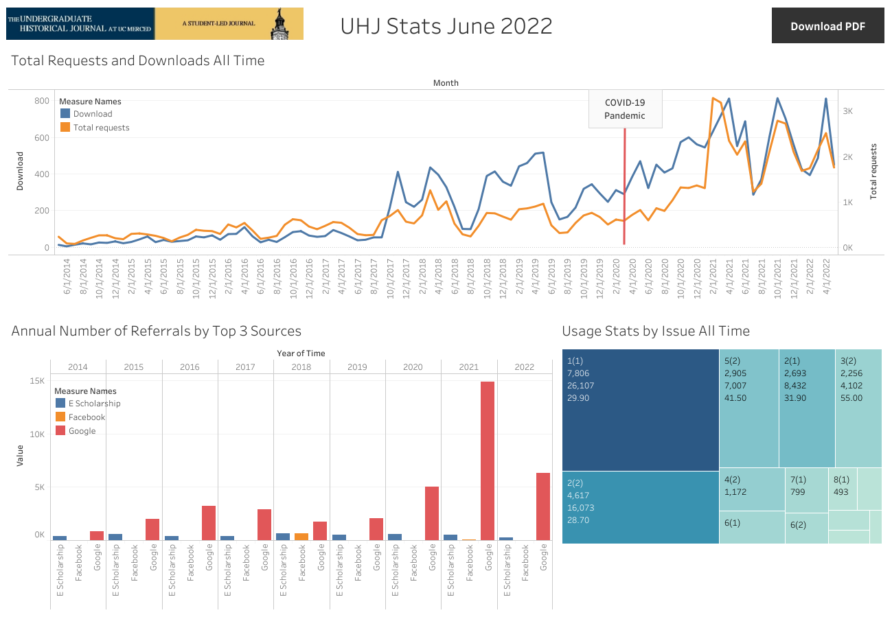

```{r setup, include=FALSE}
knitr::opts_chunk$set(message=FALSE,warning=FALSE, cache=FALSE)
knitr::opts_knit$set(root.dir = "C:/Users/bowma/Documents/data_analyst_portfolio")
```

Tableau is a great way to keep other people in your organization informed, particularly if they are only interested in the patterns and insights in order to make decisions. I was able to use Tableau to visualize the monthly updates related to the SQL queries I discussed in the first tab of this portfolio. 

Keeping all the editors informed about trends, item performance, and temporal engagement patterns is important to help them understand their product but also their organization. Below is a dashboard containing some of the key data from eScholarship. The interactive viz can be found of Tableau Public [here](https://public.tableau.com/views/UHJStats/Dashboard?:language=en-US&:display_count=n&:origin=viz_share_link 'Go to Tableau Public').


