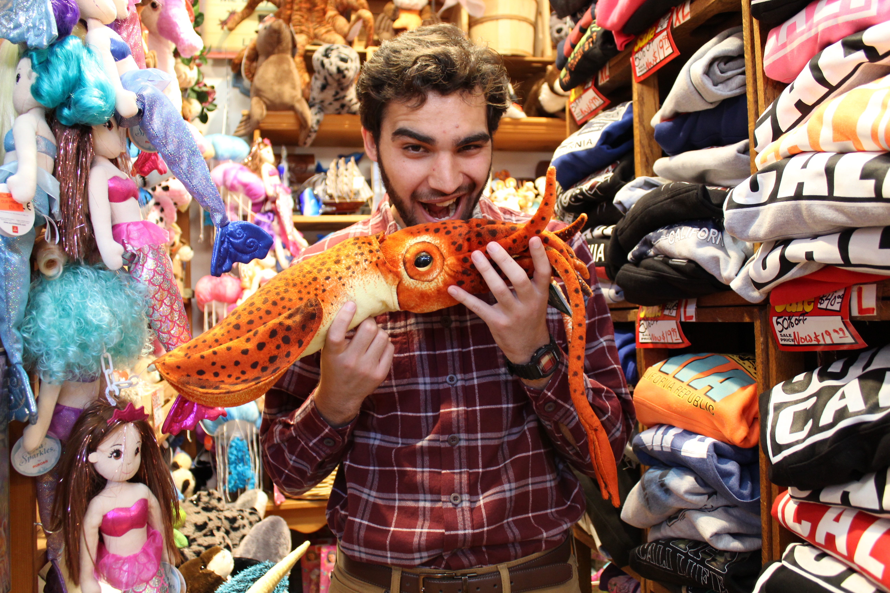
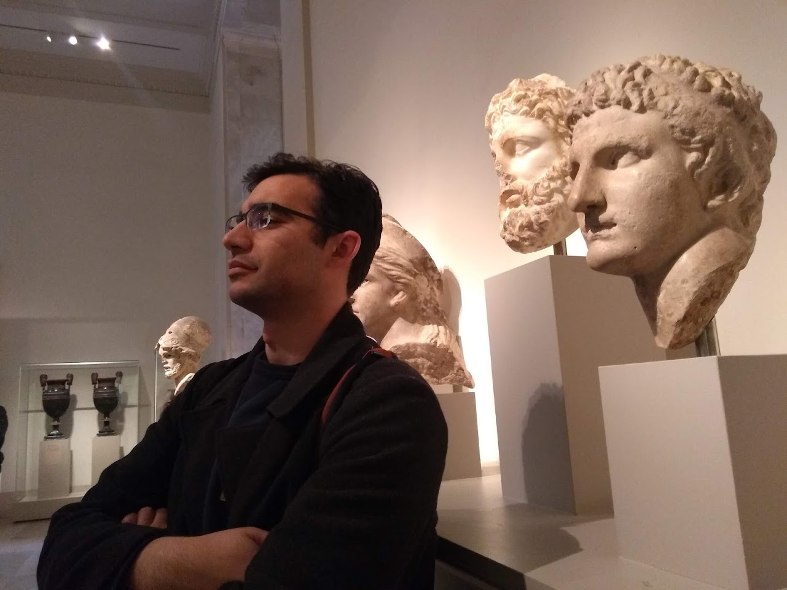

# **About me**

My name is Rocco and **I love to solve problems that help people and organizations do what they do best**. I also enjoy always learning new skills and tools that enable me to help in more capacities in an beyond SQL, R, Python, and GIS which I have used to publish peer-reviewed research during my PhD, enhance museum exhibits, and help first responders manage vital databases.

Use the tabs above to explore some of the solutions I have worked on over the years and the tools I used to make them happen.
 
 
 
 

<a href = "https://roccobowman.github.io/rbowman-data-analyst">

# **Things I like**

I like food and making food, particularly things like fresh pizza and pasta as well as cookies and cakes. This likely comes from many positive memories in Italian delis as a kid. I enjoy feeding people! 

I love watching the sunset in San Diego with a gelato in my hand and my wife by my side. I also love doggos and hope to adopt one soon.
 
 
 
 
 
 
 

<a href = "https://roccobowman.github.io/rbowman-data-analyst">
{width=50%}